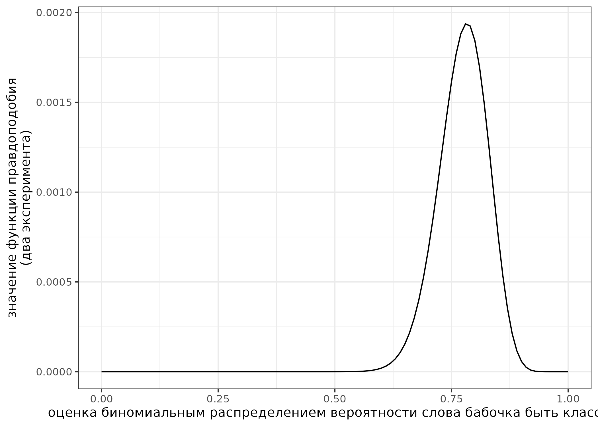

```{r, message=FALSE}
library(tidyverse)
```

Это [rmarkdown](https://rmarkdown.rstudio.com/) документ. Чтобы его скомпилировать, можно нажать в RStudio кнопку Knit. Вставьте ваше имя в заголовок, а код в соответствующие фрагменты, выделенные знаками \`.

## task 1.1

Дан график логнормального распределения с лог-средним 3 и лог-стандартным отклонением 0.5. Посчитайте закрашенную площадь под кривой. В ответе выведите в консоль значение с точностью до трех знаков после запятой.


```{r}
# Ответ на задание 1.1
integrate(function(x){dlnorm(x, mean = 3, sd = 0.5)}, lower = qlnorm(p=0.1, mean = 3, sd = 0.5, lower.tail = TRUE, log.p = FALSE), upper = qlnorm(p=0.9, mean = 3, sd = 0.5, lower.tail = TRUE, log.p = FALSE))
```

## task 1.2

В работе [Moroz, Verhees 2019] исследовалась вариативность классовой атрибуции в андийском языке и выяснилось, что 9 носителей относят слово *бабочка* к классу *b* и 7 носиителей относят слово к классу *r*. В новой итерации эксперимента 38 носителей отнесли слово *бабочка* к классу *b* и 6 носителей отнесли слово к классу *r*. Визуализируйте функцию правдоподобия и посчитайте какой из вариантов, заданный функцией `seq(0, 1, by = 0.01)`, имеет наибольшее значение функции правдоподобия.



```{r}
# Ответ на задание 1.2
n1_b <- 9
n1_r <- 7


n2_b <- 38
n2_r <- 6

 
likelihood_function <- function(p) {
  likelihood_1 <- dbinom(x = n1_b, size = n1_b + n1_r, prob = p)
  likelihood_2 <- dbinom(x = n2_b, size = n2_b + n2_r, prob = p)
  
  return(likelihood_1 * likelihood_2)
}

values <- seq(0, 1, by = 0.01)

# Вычисляем значения функции правдоподобия для каждого параметра из последовательности
likelihood_values <- sapply(values, function(p) likelihood_function(p))

# Максимальное значение
max_likelihood <- values[which.max(likelihood_values)]

plot(values, likelihood_values, type = "l", xlab = "Значения параметра p", ylab = "Значение функции правдоподобия", main = "Функция правдоподобия")
abline(v = max_likelihood, col = "red", lty = 2)
text(max_likelihood, max(likelihood_values), round(max_likelihood, 2), pos = 4, col = "red")
```

## task 1.3

[В датасете](https://afbo.info/pairs.csv?sEcho=1&iSortingCols=1&iSortCol_0=0&sSortDir_0=asc) собраны данные из базы данных [AfBo](https://afbo.info/). В этой базе данных собрана информация о том, какие языки из каких языков заимствовавали суффиксы. Скачайте данные, отфильтруйте ниболее достоверные значения (т. е. такие, чтобы в переменной `reliability` было значение `high`), воспользуйтесь методом максимального правдоподобия, чтобы оценить параметры экспоненциального распределения (смотрите справку командой `?dexp`), описывающего распределение количества заимствованных суфиксов (переменная `count_borrowed`), а потом визуализируйте данные и найденное распределение.


```{r, message=FALSE}
library(fitdistrplus)
```

```{r}
# Ответ на задание 1.3
data <- read.csv("https://afbo.info/pairs.csv?sEcho=1&iSortingCols=1&iSortCol_0=0&sSortDir_0=asc")
filtered_data <- data %>% filter(reliability == "high")

lambda <- 1/mean(filtered_data$count_borrowed)

ggplot() +
  geom_histogram(data = filtered_data, aes(x = count_borrowed, y = ..density..), bins = 10, fill = "skyblue", color = "black") +
  stat_function(fun = dexp, args = list(rate = lambda), color = "red") +
  labs(x = "count_borrowed", y = "density") +
  theme_minimal()
```

## task 1.4

Место для рефлексии по поводу ответов. Заполняется после того, как присланы ответы на задания до 13.02.2024 23:59. Это оцениваемое задание.
