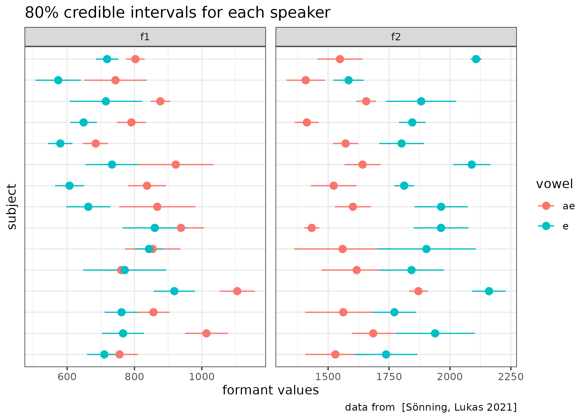
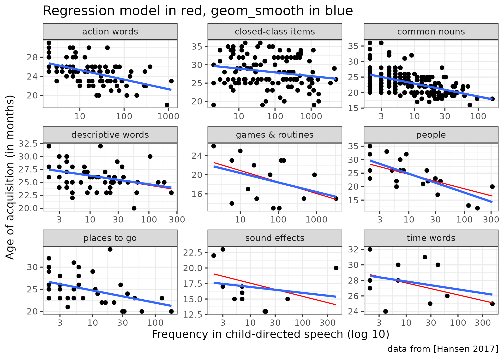
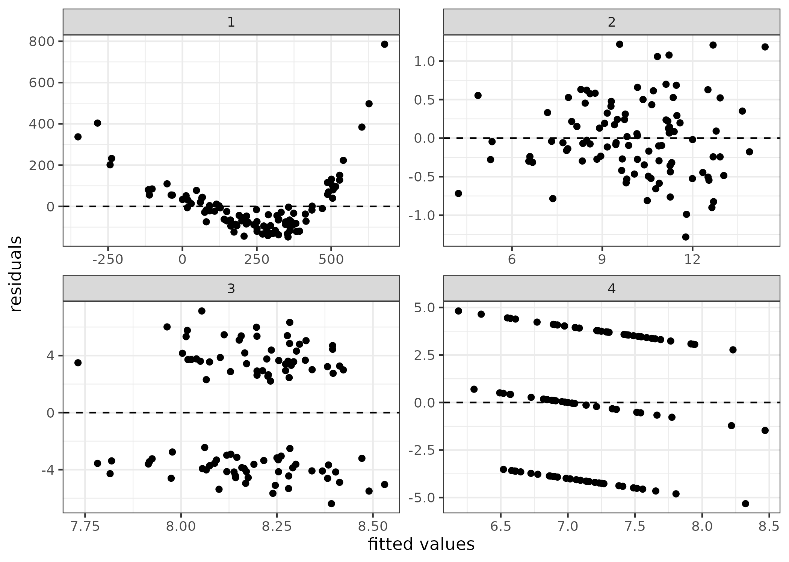

```{r, message=FALSE}
library(tidyverse)
theme_set(theme_bw())
knitr::opts_chunk$set(message = FALSE)
library(fitdistrplus)
library(lme4)
library(lmerTest)
```

## task 3.1 (вес задания: 3)

В датасет `vowel_data.csv` записаны значения формант гласных для носителей британского английского языка из исследования [Sönning, Lukas 2021]. Используя данные всех носителей, проведите эмпирическую байесовскую оценку, чтобы получить априорное распределение, сделайте байесовский апдейт всех носителей и постройте график 80% доверительных интервалов для каждого носителя. Какой носитель, согласно полученным доверительным интервалам, показывает самую невыразительную разницу между гласными?

```{r}
br_vowels <- read_csv("vowel_data.csv")

e_f1 <- fitdist(br_vowels$F1[br_vowels$vowel == "e"], "norm", method = 'mle')
e_f2 <- fitdist(br_vowels$F2[br_vowels$vowel == "e"], "norm", method = 'mle')
ae_f1 <- fitdist(br_vowels$F1[br_vowels$vowel == "ae"], "norm", method = 'mle')
ae_f2 <- fitdist(br_vowels$F2[br_vowels$vowel == "ae"], "norm", method = 'mle')

e_f1$estimate %>% 
  bind_rows(e_f2$estimate,
            ae_f1$estimate,
            ae_f2$estimate) %>% 
  mutate(formant = c("f1", "f2", "f1", "f2"),
         vowel = c("e", "e", "ae", "ae")) %>% 
  rename(mean_prior = mean,
         sd_prior = sd) ->
  priors


br_vowels %>% 
  group_by(subject, vowel) %>% 
  summarise(mean_f1 = mean(F1),mean_f2 = mean(F2),sd_f1 = sd(F1),sd_f2 = sd(F2)) %>% 
  pivot_longer(names_to = "type", values_to = "values", mean_f1:sd_f2) %>% 
  separate(type, into = c("type", "formant")) %>% 
  pivot_wider(values_from = values, names_from = "type") %>%
  left_join(priors) %>% 
  rowwise() |> 
  mutate(sd_pr = 1/sqrt(1/sd_prior^2 + 1/sd^2),mean_value = weighted.mean(c(mean_prior, mean), c(1/sd_prior^2, 1/sd^2)),
                     cred_int_l_80 = qnorm(0.1, mean_value, sd_pr),
                     cred_int_h_80 = qnorm(0.9, mean_value, sd_pr),
                     cred_int_mean = cred_int_h_80-(cred_int_h_80-cred_int_l_80)/2) |> 
  ggplot(aes(y = subject, x = cred_int_mean, xmin = cred_int_l_80, xmax = cred_int_h_80, color = vowel))+
  geom_pointrange()+ 
  facet_wrap(~formant, scales = "free")+
  labs(x = "formant values", y = 'subject', caption  = "data from  [Sönning, Lukas 2021]", title = "80% credible intervals for each speaker")

#чем меньше разброс значений формантов, тем ближе они друг к другу, что может указывать на менее выраженные различия в произношении гласных
```



Ответ: NS05

## task 3.2 (вес задания: 3)

В датасет `norwegian_lexical_development.csv` записаны данные из исследования [Hansen 2017], посвященного усваиванию лексики носителями норвежского. В датасете собраны следующие переменные:

* `Word_NW` -- норвежские слова;
* `Translation` -- перевод норвежских слов на английский;
* `CDS_freq` -- усредненная частота слова в речи, адресованной детям;
* `AoA` -- усредненный возраст освоения слова (в месяцах);
* `Lex_cat` -- лексическая категория, приписанная исследователями.

Постройте и визуализируйте лучшую регрессию, которая предсказывает возраст усвоения слова в зависимости от частотности в речи, адресованной детям. Помните про необходимость преобразования переменных, чтобы связь была линейной. Сравните полученный результат с результатом работы функции `geom_smooth()`, которая генерирует отдельную независимую регрессию для каждой из групп.

```{r}
data <- read.csv("norwegian_lexical_development.csv")


data$CDS_freq_log10 <- log10(data$CDS_freq)
data$AoA <- as.numeric(data$AoA)  
reg_model <-  lmer(AoA~log(CDS_freq)+(1+log(CDS_freq)|Lex_cat), data = data)
data$predicted <- predict(reg_model)


ggplot(data, aes(x = CDS_freq_log10, y = AoA, color = Lex_cat)) +
  geom_point(color = "black") +
  geom_line(aes(y = predicted), color = "red") +
  geom_smooth(method = "lm", se = FALSE, color = "blue", size = 0.5) +
  facet_wrap(~Lex_cat, scales = "free") +
  labs(x = "Frequency in child-directed speech (log 10)", y = "Age of Acquisition (in months)", title = "Regression model in red, geom_smooth in blue")
```



## task 3.3 (вес задания: 2)

Перед вами четыре графика остатков. Проанализируйте каждый из них и опишите нарушения ограничений на применение регрессии, которые вы можете увидеть.



### График 1

#Связь нелинейна, модель может давать неточные прогнозы

### График 2

#Распределение остатков непостоянно, что может привести к неверным выводам

### График 3

#График поделен на две части

### График 4

#Остатки параллельны